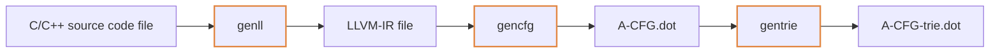
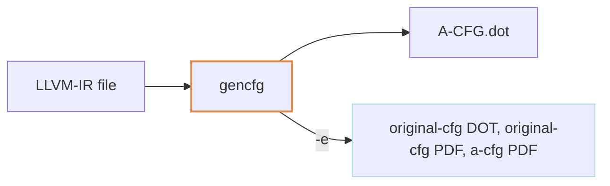
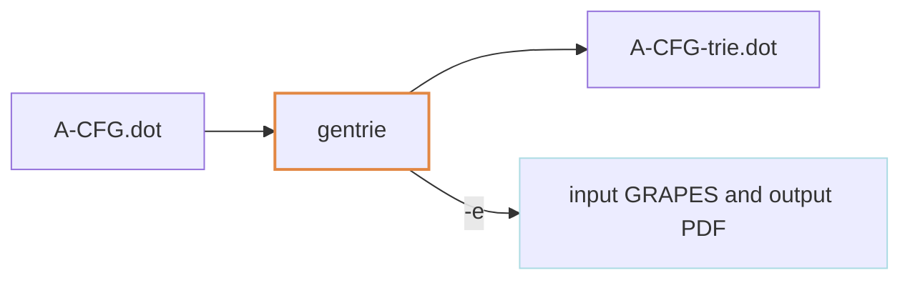

# CFG_TO_TRIE

This module includes all steps needed to generate an *abstract*-CFG of a
**C/C++ function** and save it as prefix-tree.
It starts from a C/C++ source code file and produces a `.dot` file of
the prefix tree corresponding to the *abstract*-CFG.




### 1. Preprocess (`genll`)

Starting from a C/C++ source code file, generates its LLVM-IR using
Clang/Clang++ v.7.0.0.


Usage:
```
genll [-h] [-cpp] [-o OUT_FILENAME] file
```
Positional arguments:
  - `file` &emsp; input file (C or C++ source)

Options:
- `-h`, &nbsp; `--help` &emsp; show this help message and exit.
- `-cpp`, &nbsp; `--use-clang-cpp` &emsp; use clang++ instead of clang.
- `-o OUT_FILENAME`, &nbsp; `--output OUT_FILENAME` &emsp;
output LLVMIR file name.

By default, `genll` generates in the *current directory* a `.ll` file
with the same name as input file, removing the extension. A different output filename (with extension) can be specified with `-o` / `--output` option. E.g:\
`$ genll input.c` generates `input.ll`.\
`$ genll input.c -o newfilename.ll` generates `newfilename.ll`.


### 2. Generation of *abstract-CFG*
Starting from a LLVM-IR representation of a program:
1. uses `opt-7` to generate the original cfgs;
2. selects one of these cfgs (only one function is supported for now);
3. generates a new *abstract cfg* of the selected function;
4. (saves it as `dot` file).

TODO

The way this *abstract cfg* is generated can be changed
with these parameters:
- `map` ID or csv file:
- `const` flag:
- `var` flag:
- (in the future) `sty` flag:


Usage:
```
gencfg [-h] [-m MAP] [-sty] [-nv] [-nc] [-ncut] [-o OUT_FILENAME] [-f FUNCTION_NAME] [-e] [-d] llvmir_file
```

Positional arguments:
- `llvmir_file` &emsp; input .ll file

Options:
- `-h`, &nbsp; `--help` &emsp;            show this help message and exit
- `-m MAP`,&nbsp;  `--mapping MAP` &emsp;
map-id [0-4] or csv file
- `-nv`, &nbsp; `--no-var` &emsp; do not generate variables subgraph
- `-nc`, &nbsp; `--no-const` &emsp; do not generate constants subgraph
- `ncut`, &nbsp; `--no-cut` &emsp; do not 'clean' tree: e.g. removing
unuseful terminators
- `-o OUT_FILENAME`, &nbsp; `--output OUT_FILENAME`
&emsp; output abstract cfg file name
- `-f FUNCTION_NAME`, &nbsp; `--function FUNCTION_NAME`
&emsp; name of function in the source code of which to generate the
abstract cfg
- `-e`, &nbsp; `--extra-output` &emsp; extra output: original cfg dot,
original cfg dot, abstract cfg pdf

By default, for an input file name `<input>.ll`, the abstract cfg will
be saved in `a-cfg-<input>-<function>.dot`. If the function is not
specified with `-f`, the program creates the abstract cfg only if
it founds only one function in the program; otherwise, a function name
must be specified.

The `MAP` value can be and integer corresponding to an ID of predefined
map (0..4) or a path to a csv file:
see [below](#More-details:-GENCFG-mapping).


### 3. Generation of prefix free of *abstract-CFG*
Starting from a graph in a `.dot` file, uses
[GraphGrepSX](https://github.com/InfOmics/GraphGrepSX) to generate
the prefix tree (with a path-length given in input) of the input
graph and then prints it to a `.dot` file.



Usage:
```
gentrie [-h] [-lp LENGTH_PATH] [-o OUT_FILENAME] [-e] dot_file
```

Positional arguments:
- `dot_file` &emsp; input .dot file

Options:
- `-h`, &nbsp; `--help` &emsp; show this help message and exit
- `-lp LENGTH_PATH`, &nbsp; `--length-path LENGTH_PATH`
&emsp; set max DFS depth to LP (GraphGrepSX)
- `-o OUT_FILENAME`, &nbsp; `--output OUT_FILENAME`
&emsp; output prefix tree file name
- `-e`, &nbsp; `--extra-output` &emsp; extra output: input .grapes and output .pdf


By default, `gentrie` generates in the *current directory* a `.dot` file
named `trie-<INPUT-FILENAME>.dot`, where `<INPUT-FILENAME>` is the input
filename with extension removed. A different output filename (with extension) can be specified with `-o` / `--output` option.
With `-e` option, an extra output is generated: the `.grapes` file used
to execute `GraphGrepSX` and the pdf of output graph.\
E.g:\
`$ gentrie input.dot` generates `trie-input.dot`.\
`$ gentrie input.dot -o new-out.dot` generates `new-out.dot`.\
`$ gentrie input.c -e` generates `trie-input.dot`, `trie-input.pdf`,
`input.grapes`.\
`$ gentrie input.dot -o new-out.dot -e` generates `new-out.dot`,
`input.grapes`, `new-out.pdf`.

## More details: IV - Instruction visitor

Starting from a single LLVM 7.0 instrunction, generates a set of tuples,
which contain information about the instruction. Each tupla is made of
a key and a value. The key is not indendet to be unique in the set.

key            | value                                                 | test
---------------|-------------------------------------------------------|------
`op`           | opcode (reserved keywords)                            | PASS
`write`        | varname of a **variable** "written" by the instruction| PASS *1
`read`         | varname of a **variable** "read" by the instruction   | PASS *1
`const`        | simple **constant** used by the instruction           | PASS
`const-expr`   | **constant expression** used by the instruction       | PASS
*varname*-`sty`| simplified **type** of variable *varname*             | TODO
*varname*-`ty` | LLVM-**type** of variable *varname*                   | PASS *2
`call`         | function name called by the instruction               | PASS


*1: has a const-expr write access (e.g. in `store` instruction)?
And other minor fixes to do.


*2: some temporary placeholder are used.

Notes:
- a "variable" is any `value->localIdent` or `value->constant->globalIdent`
- `globalIdent`(s), that are `constant`(s), are excluded from `const` and
`const-expr` tuples.

### Read/write access (`read`, `write`)

There are constant expression handling and other minor things to do.

### Type inference (`*-ty`, `*-sty`)

Type inference can be done (indipendently) on:
1. type of generated value: check the type of generated value by a
    `valueInstruction` and assign it to the `localIdent` on the lhs
    in the production `localIdent = valueInstruction`;

    **--> DONE (with some semplifications\*)**

2. type(s) of instruction's argument(s).

    **--> TO DO ? (could be unuseful due to SSA form of LLVM-IR)**


*: There is a set of instructions that handles aggregate types:
`getElementPtrInst`, `insertValueInst`, `extractValueInst`. In this
instructions, if a named type is used it's impossible to get the type
of the field without knowing the structure itself. So, more knowledge
is needed: this can be done parsing all the `.ll` file and get information
about named types (and global identifiers). For now, a set of placeholder
is used instead of parsing the `.ll` file.

#### Simplified types

|                   |        |            |
|-------------------|--------|------------|
|                   | syntax | simplified |
| Void type         | `void` | void |
| Function type     |`<returntype> (<parameter list>)` | simplified(returntype) |
|(Single value types)|||
| Integer type      | `iN`  (where `N` is the number of bits) | `int` |
| Floating-Point type| `half\|float\|double\|fp128\|x86_fp80\|ppc_fp128` | `float` |
| X86_mmx type      | `x86_mmx` | `x86_mmx` |
| Pointer type      | `<type> *` | simplified(type)`*` |
| Vector type       | `< <# elements> x <elementtype> >` | `<`simplified(elementtype)`>` |
| Label type        | `label` | `label` |
| Token type        | `token` | `token` |
| Metadata type     | `metadata` | `metadata` |
|(Aggregate types)|||
| Array type        | `[ <# elements> x <elementtype> ]` | `[`simplified(elementtype)`]` |
| Structure type    | `{ <type list> } \| <{ <type list> }>` | `struct`


## More details: GENCFG mapping

CLI option `-m MAP-ID` or `-m path_to_map_csv`

### MAP-ID = 0

(`map-nomap-0.csv`)

No mapping (1-to-1): each LLVM instruction is mapped to the instruction
name itself.
Exception made for all intrinsic instructions, that are mapped with label
`intrinsic`.

### MAP-ID = 1

(`map-ref-1.csv`)

Follow the categories of LLVM-IR language reference.

Number of classes: **9**

| instructions | label |
| ----- | ----- |
| ret, br, switch, indirectbr, invoke, callbr, resume, unreachable, catchswitch, catchret, cleanupret |                                        terminator  |
| add, sub, mul, udiv, sdiv, urem, srem, fadd, fsub, fmul, fdiv, frem, fneg |                                                                  bynary  |
| shl, lshr, ashr, and, or, xor |                                                                         bitwise  |
| extractelement, insertelement |                                                                     vector  |
| shufflevector, extractvalue, insertvalue |                                                           aggregate  |
| load, store, fence, cmpxchg, atomicrmw, alloca, getelementptr |                                                                          memory  |
| trunc, zext, sext, fptrunc, fpext, fptoui, fptosi, uitofp, sitofp, ptrtoint, inttoptr, bitcast, addrspacecast |conversion  |
| icmp, fcmp, select, , call, phi, freeze, va_arg, landingpad, catchpad, cleanuppad |                                                                   other  |
| llvmllvm.\* |                                                                                      intrinsic  |
| \* |                                                                                               undef |


### MAP-ID = 2

(`map-ref-loadstore-2.csv`)

Same as map 1 (follows the categories of LLVM-IR language reference)
but with `load` and `store` alone.

Number of classes: **11**

| instructions | label |
| ----- | ----- |
| ret, br, switch, indirectbr, invoke, callbr, resume, unreachable, catchswitch, catchret, cleanupret |                                        terminator  |
| add, sub, mul, udiv, sdiv, urem, srem, fadd, fsub, fmul, fdiv, frem, fneg |                                                                  bynary  |
| shl, lshr, ashr, and, or, xor |                                                                         bitwise  |
| extractelement, insertelement |                                                                     vector  |
| shufflevector, extractvalue, insertvalue |                                                           aggregate  |
| load |                                                                                             load  |
| store |                                                                                            store  |
| fence, cmpxchg, atomicrmw, alloca, getelementptr |                                                                          memory  |
| trunc, zext, sext, fptrunc, fpext, fptoui, fptosi, uitofp, sitofp, ptrtoint, inttoptr, bitcast, addrspacecast |conversion  |
| icmp, fcmp, select, , call, phi, freeze, va_arg, landingpad, catchpad, cleanuppad |                                                                   other  |
| llvmllvm.\* |                                                                                      intrinsic  |
| \* |                                                                                               undef |

### MAP-ID = 3

(`map-ref-loadstore-2.csv`)

Number of classes: **13**

Same as map 2 (language reference categories + load and store)
but with `phi` and `call` alone.

| instructions | label |
| ----- | ----- |
| ret, br, switch, indirectbr, invoke, callbr, resume, unreachable, catchswitch, catchret, cleanupret |                                        terminator  |
| add, sub, mul, udiv, sdiv, urem, srem, fadd, fsub, fmul, fdiv, frem, fneg |                                                                  bynary  |
| shl, lshr, ashr, and, or, xor |                                                                         bitwise  |
| extractelement, insertelement |                                                                     vector  |
| shufflevector, extractvalue, insertvalue |                                                           aggregate  |
| load |                                                                                             load  |
| store |                                                                                            store  |
| fence, cmpxchg, atomicrmw, alloca, getelementptr |                                                                          memory  |
| trunc, zext, sext, fptrunc, fpext, fptoui, fptosi, uitofp, sitofp, ptrtoint, inttoptr, bitcast, addrspacecast |conversion  |
| call |                                                                                             call  |
| phi |                                                                                              phi  |
| icmp, fcmp, select, freeze, va_arg, landingpad, catchpad, cleanuppad |                                                                   other  |
| llvmllvm.\* |                                                                                      intrinsic  |
| \* |                                                                                               undef |


### MAP-ID = 4

(`map-ref-more-detail-4.csv`)

Same as map 3 (language reference categories + load, store, phi, call alone)
but with more detailed categories and other instructions alone.


Number of classes: **18**

| instructions | label |
| ----- | ----- |
| ret, br, switch, indirectbr, invoke, callbr, resume, unreachable |                                        terminator  |
| catchswitch, catchret, cleanupret |                                                                  terminator-exception   |
| add, sub, mul, udiv, sdiv, urem, srem |                                                                  bynary-int  |
| fadd, fsub, fmul, fdiv, frem, fneg |                                                                    binary-float |
| shl, lshr, ashr, and, or, xor |                                                                         bitwise  |
| extractelement, insertelement |                                                                     vector  |
| shufflevector, extractvalue, insertvalue |                                                           aggregate  |
| load |                                                                                             load  |
| store |                                                                                            store  |
| fence, cmpxchg, atomicrmw |                                                                          memory  |
| alloca |                                                                                           alloca  |
| getelementptr |                                                                                    getelementptr  |
| trunc, zext, sext, fptrunc, fpext, fptoui, fptosi, uitofp, sitofp, ptrtoint, inttoptr, bitcast, addrspacecast |conversion  |
| call |                                                                                             call  |
| phi |                                                                                              phi  |
| icmp, fcmp, select, freeze, va_arg |                                                                   other  |
| landingpad, catchpad, cleanuppad |                                                                   exception  |
| llvmllvm.\* |                                                                                      intrinsic  |
| \* |                                                                                               undef |